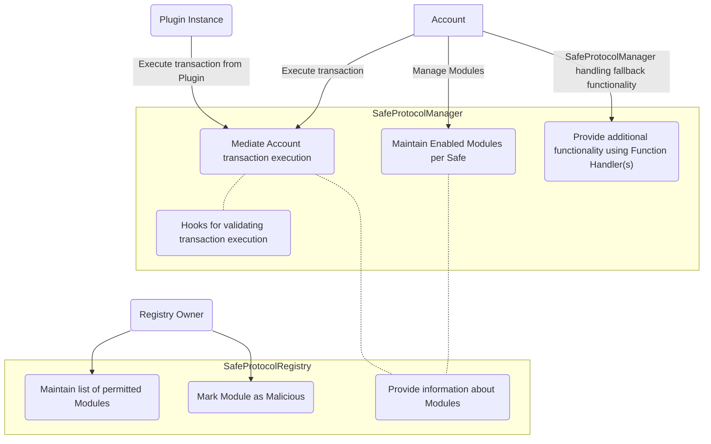
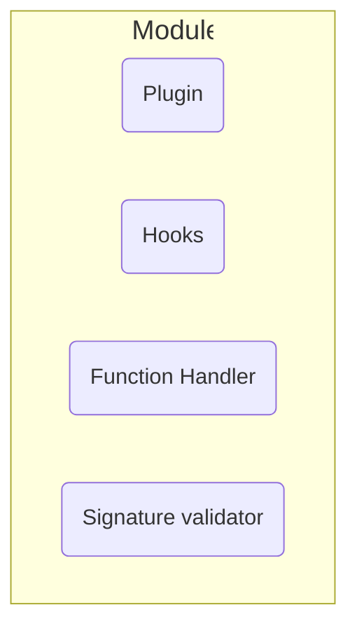

**:warning: This repository is not actively developed at the moment. :warning:**

[](https://coveralls.io/github/safe-global/safe-core-protocol)

# Safe{Core} Protocol

This project is an implementation of [Safe{Core} Protocol specification](https://github.com/safe-global/safe-core-protocol-specs)

## Architecture

Safe{Core} Protocol implementation consists of following main components:

-   [SafeProtocolManager](./contracts/SafeProtocolManager.sol)
-   [SafeProtocolRegistry](./contracts/SafeProtocolRegistry.sol)
-   [Interfaces for Modules](./contracts/interfaces/Modules.sol)

A high level overview of the architecture is as follows:



### Modules



Currently implemented components of the Safe{Core} Protocol are:

-   **SafeProtocolManager**
-   **SafeProtocolRegistry**
-   **Plugins**
-   **Hooks**
-   **Function Handler**
-   Additionally a test version of registry **TestSafeProtocolRegistryUnrestricted** is also available.

[Execution flows](./docs/execution_flows.md) give a high-level overview of the different flows for the Safe{Core} Protocol.

## Deployments

All the deployed addresses of contracts are available in [deployments.ts](./deployments.ts) for each network along with contract abis. Alternatively, all the addresses are also available in a [markdown file](./docs/deployments.md)

## Using solidity interfaces

The solidity interfaces for the Safe{Core} Protocol contracts are available in [interfaces](./contracts/interfaces) directory. These interfaces are available for import into solidity smart contracts via the npm artifact.

To install the npm package, run the following command:

```bash
npm i @safe-global/safe-core-protocol
```

E.g. Create a plugin

```solidity
import {ISafeProtocolPlugin} from "@safe-global/safe-core-protocol/contracts/interfaces/Modules.sol";

contract SamplePlugin is ISafeProtocolPlugin {

    function name() external view returns (string memory name) {
        ...
    }

    function version() external view returns (string memory version){
        ...
    }

    function metadataProvider() external view returns (uint256 providerType, bytes memory location){
        ...
    }

    function requiresPermissions() external view returns (uint8 permissions){
        ...
    }

}
```

For more examples and information on adding Module(s) to the Registry, refer to [Safe{Core} Protocol demo](https://github.com/safe-global/safe-core-protocol-demo/tree/main/contracts)

## Useful commands

### Install

```bash
yarn
```

### Compile

```bash
npx hardhat compile
```

### Test

```bash
npx hardhat test
```

### Deploy

-   Deploy test contracts network to goerli.
    -   [test registry](./contracts/test/TestSafeProtocolRegistryUnrestricted.sol)
    -   [test manager](./contracts/test/TestSafeProtocolManager.sol)
    ```bash
    yarn hardhat deploy --network goerli --tags test-protocol --export-all deployments.ts
    ```
-   Deploy contracts with [SafeProtocolRegistry](./contracts/test/TestSafeProtocolRegistryUnrestricted.sol) registry network to goerli.
    ```bash
    yarn hardhat deploy --network goerli --tags protocol --export-all deployments.ts
    ```

### Other commands

| Command                                                                                      | Description                                                                                                                          |
| -------------------------------------------------------------------------------------------- | ------------------------------------------------------------------------------------------------------------------------------------ |
| `yarn hardhat generate:deployments`                                                          | Generate deployments markdown in [./docs/deployments.md](./docs/deployments.md) from [./deployments.ts](./deployments.ts)            |
| `yarn hardhat verify --network goerli <contract_address> <initial_owner>`                    | Verify Registry contract(s)<br/> Applicable for<br/> - SafeProtocolRegistry.sol<br/> - TestSafeProtocolRegistryUnrestricted.sol<br/> |
| `yarn hardhat verify --network goerli <contract_address> <initial_owner> <registry_address>` | Verify SafeProtocolManager.sol                                                                                                       |
