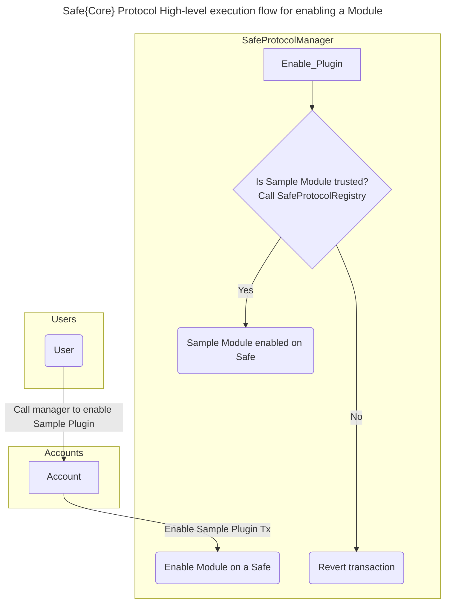
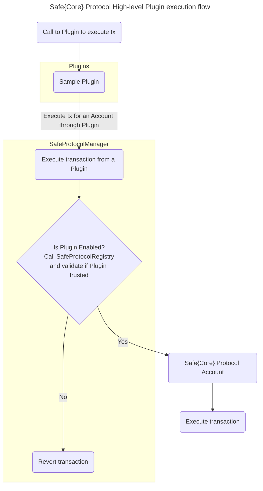
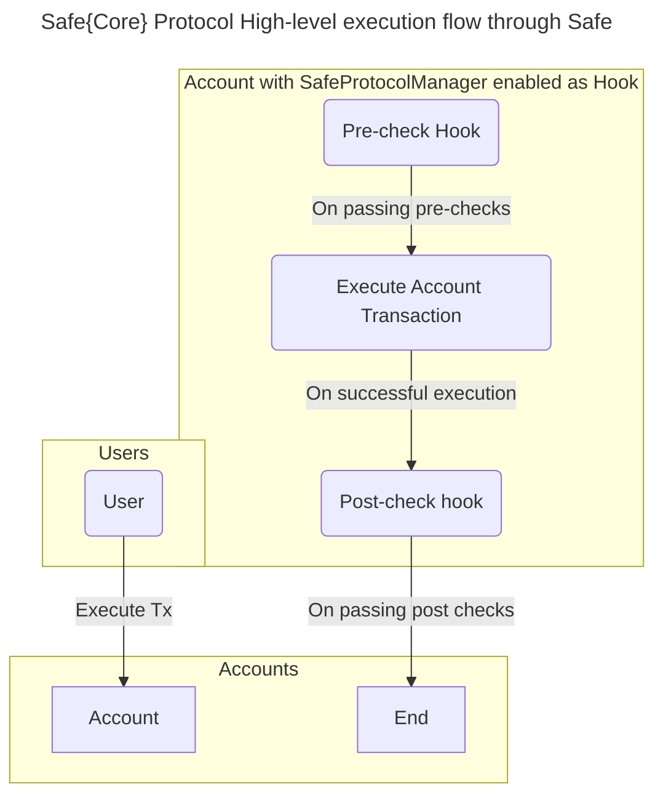
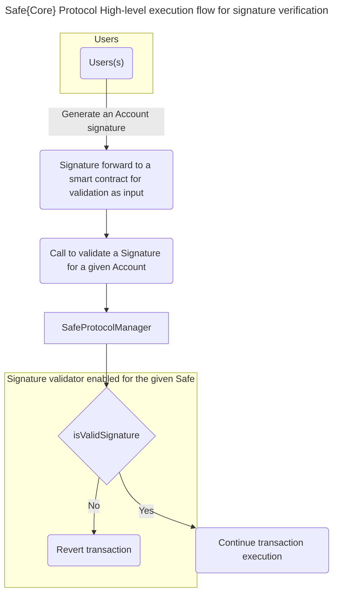

# High-level overview of Execution Flows

The below sections provide a high-level overview of the execution different flows for the Safe{Core} Protocol.

## Enable Module flow

## Transaction execution through Plugin

## Account transaction execution with Hooks

## Function Handler

## Signature Validator

